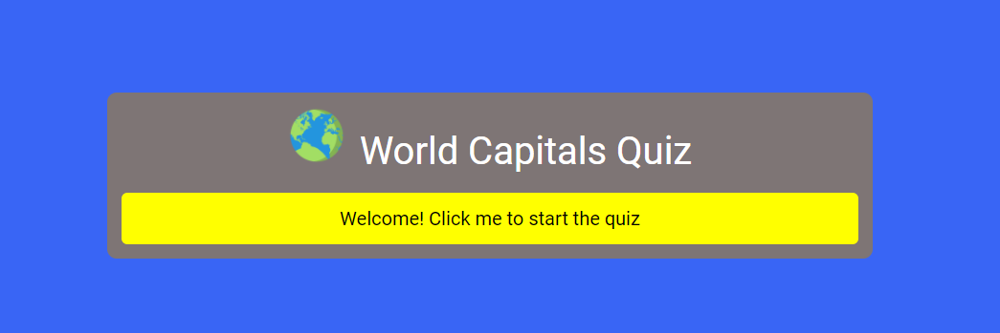
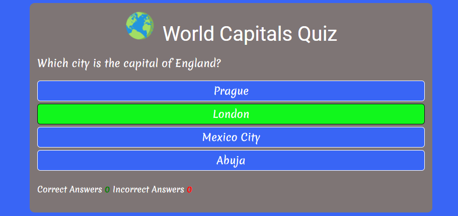
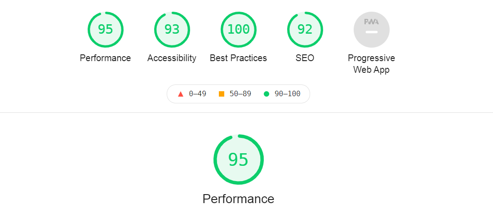

# World Capitals Quizzzzz...!

A simple quizz for geography lovers as well as for people who want to test their knowledge about world capitals.
This quiz will allow people to quickly remember the capitals of the countries of the world!
The main goal of the quiz is to have fun through learning.

 [I am the link to the website](https://fabrizioadi.github.io/World-Capitals-Quiz/) Hello good people !

## Table of Contens

* [Table of Contents](#table-of-contents)
    + [Features](#features)
    + [The Game Options](#the-game-options)
    + [The Game Results](#the-game-results)
    + [Features left to implement](#features-left-to-implement)
    + [Testing](#testing)
    + [Validator Testing](#validator-testing)
    + [Technologies](#technologies)
    + [Deployment](#deployment)
      - [Step to Using Github Pages](#step-to-using-github-pages)
    + [Credits/Reference](#credits-reference)
    + [Author Info](#author-info)

<small><i><a href='http://ecotrust-canada.github.io/markdown-toc/'>Table of contents generated with markdown-toc</a></i></small>

### Features

* Featured at the middle of the page the header shows the quizz name: "World Capitals Quiz" with a logo showing a photo of the globe, everything is on a gray rectangular background.
* The entire background of the page is blue.
* This header clearly tells the user what the quizz is about.
* The start page also includes an illuminated "Welcome! Click me to start the quizz" button, the button has a welcome form and is also intended to suggest the start of the game. As in the picture below.

### The Game Options

* The rules are simple when you get a question from the four answers below, choose correct one, which will turn green with the entire background of the page, the incorrect answer will turn red. After selecting one answer you can click the next button which will select the next random question. The Next button will appear on the left below the answers.
* These options are interactive buttons that the user can click to make their choice.

Make a choice:

### The Game Results

* The javascript code generate random question.
* When the user choice an answer the whole background turns green in case of a correct answer and red in case of a wrong answer.

### Features left to implement

* The game sholud also include a counter of correct and incorrect answers which is now only display but not work.
* Another function that I want to add is a timer that would be in line with the question. I would allocate about 10 seconds for the answer.

### Testing

* Friends also helped in testing the website they checked the operation, responsive, accessibility of the application.
* I confirme that this project is responsive, looks good and functions on all standard screen size using the devtools device toolbar.
* Colors and fonts chosen are easy to read and accessible by running it throught lighthouse in devtools. 

### Validator Testing

HTML
* Document checking completed. No errors or warnings to show.

CSS
* Document checking completed. No errors or warnings to show.

### Technologies
* HTML - will help build a solid foundation.
* CSS - define the appearance of elements and their design.
* Balsamic.com - Wireframes
* Gitpod - Container based development platform. Ready-to-code development environments in the cloud accessible through your browser and your local IDE.
* Github - The most popular of the websites that host Git repositories in the cloud. Thanks to a service like GitHub, we can share our code with other developers and work with them remotely over time.
* W3C HTML Valitator - HTML Validator
* W3C CSS Validator - CSS Validator
* W3C JAVASCRIPT Validator - JAVASCRIPT Validator
* Google Font Awsome - Very resource rich service offered by Google
* Google images

### Deployment
#### Step to Using Github Pages
* In the GitHub Repository from the project: https://fabrizioadi.github.io/World-Capitals-Quiz/
* Click the "Settings" Tab.
* Scroll Down to the Git Hub Pages Heading.
* There will be a message - Pages settings now has its own dedicated tab! press the - Check it out here!
* Select "Master Branch" as the source.
* The Page will reload "Settings" again.
* Scroll to GitHub pages heading and there will now be a clickable link to the website: https://fabrizioadi.github.io/World-Capitals-Quiz/
* Click this link for the live deployed website.

### Credits/Reference

Most of my javascript code comes from the following YouTube tutorials explaining and showing how to create quizzes from begining.

* [Build A Quiz App With JavaScript](https://www.youtube.com/watch?v=riDzcEQbX6k&t=690s)
* [Create Quiz Web App using HTML CSS and JavaScript | Quiz App JavaScript](https://www.youtube.com/watch?v=WHHYz8rZmDU)
* [How to Make a Quiz App using HTML CSS Javascript](https://www.youtube.com/watch?v=f4fB9Xg2JEY&t=2343s)
* [How To Make Quiz App With Timer Using HTML CSS & JavaScript](https://www.youtube.com/watch?v=3fbU4z7fPe4&t=979s)

Of course, I tried to create my unique code completely different from the YouTube tutorials, but it's not that simple. In part, I was able to write somewhat different code.

Acknowledgements
Also thank you to the Code Institute slack channel, tutor Kasia and mentor Precious Ijege.

### Author Info
FabrizioAdi

python3 -m http.server
